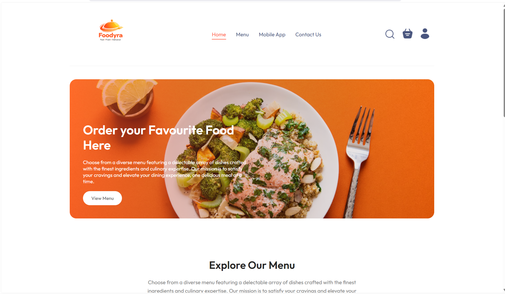
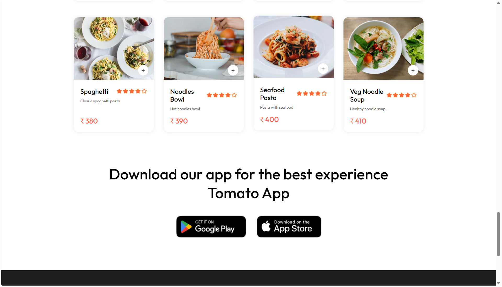
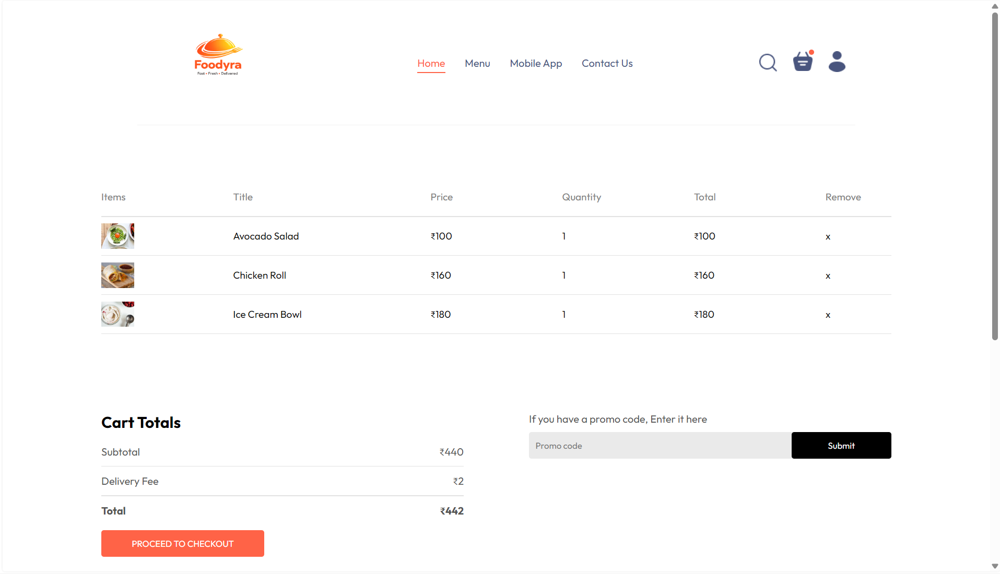
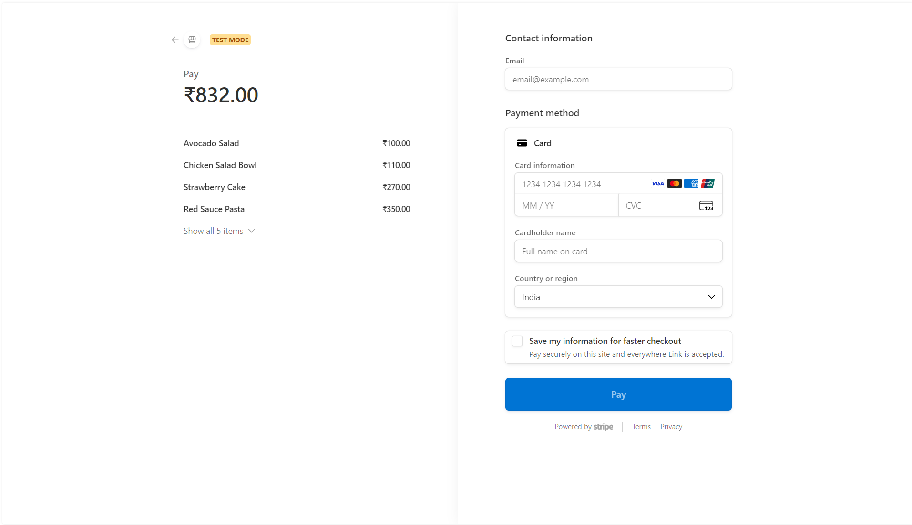
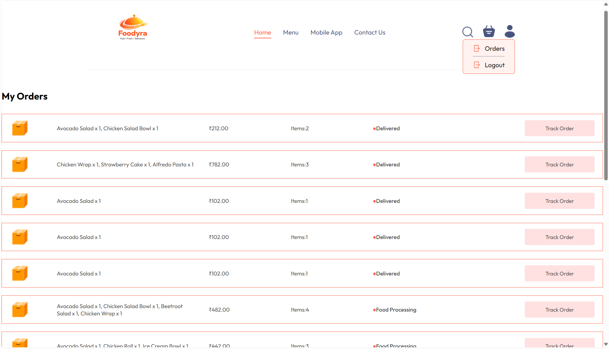
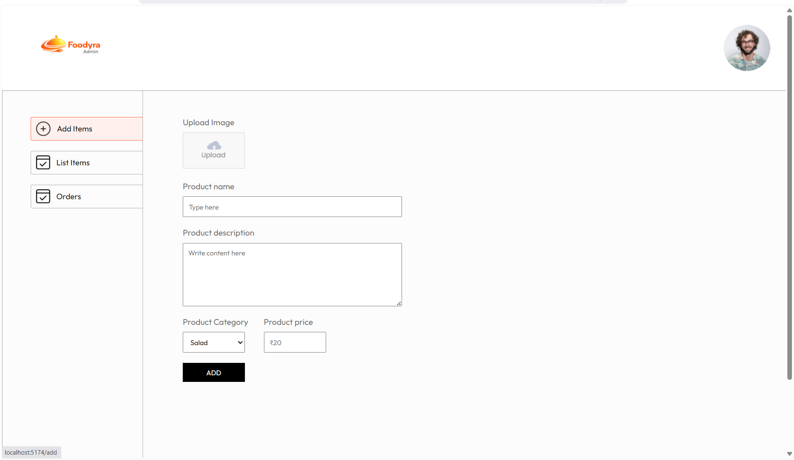
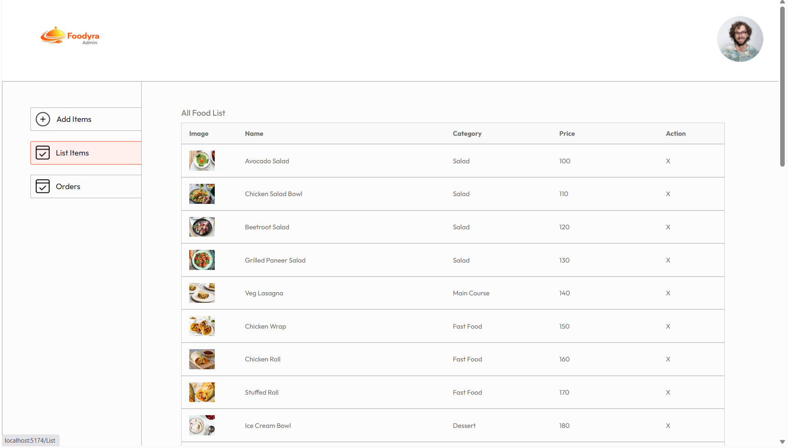
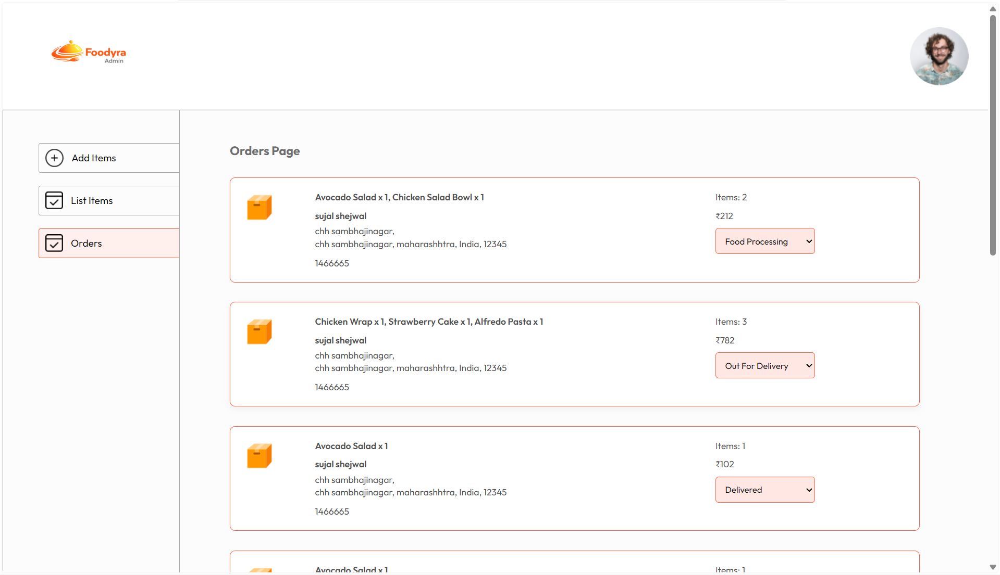

# 🍔 Food Delivery App (MERN Stack)


<p align="center">
  <a href="https://food-delivery-app-lemon-phi.vercel.app">
    
  </a>
  <a href="https://food-delivery-app-gd5y.vercel.app">
    
  </a>
</p>

---

## 📌 Overview

A **full-stack Food Delivery Web Application** built using the **MERN Stack**.
Users can browse food items, add them to cart, place orders, and make secure payments.

This project demonstrates **real-world full-stack development**, including:

* Deployment (Vercel + Render)
* API integration
* Admin dashboard management
* Handling production issues (CORS, routing)

---

## 🌐 Live Demo

### 🚀 User Frontend

👉 https://food-delivery-app-lemon-phi.vercel.app

### 🛠 Admin Panel

👉 https://food-delivery-app-gd5y.vercel.app

### ⚙ Backend API

👉 https://food-delivery-backend-rbic.onrender.com

---

## 🏗 Deployment Architecture

* 🌐 Frontend → Vercel
* 🛠 Admin Panel → Vercel
* ⚙ Backend → Render
* 🗄 Database → MongoDB Atlas

---

## 🚀 Features

* 🔐 User Authentication (Login / Signup)
* 🛒 Add to Cart & Order Management
* 💳 Secure Payment Integration (Stripe)
* 📦 Order Tracking System
* 🧑‍💼 Admin Dashboard for managing food & orders
* 🔄 Real-time data sync (Frontend ↔ Admin)
* 🔔 Notifications System

---

## 🛠️ Tech Stack

### 🔹 Frontend

* React.js (Vite)
* CSS
* Axios

### 🔹 Backend

* Node.js
* Express.js

### 🔹 Database

* MongoDB Atlas

### 🔹 Tools & Services

* Stripe API
* JWT Authentication

---

## 📂 Project Structure

```
Food-Delivery/
│
├── frontend/   # User Website (Vercel)
├── backend/    # Server & APIs (Render)
├── admin/      # Admin Dashboard (Vercel)
```

---

## ⚙️ Setup Instructions

### 1️⃣ Clone the repository

```
git clone https://github.com/Sujal-Shejwal/food-delivery-app.git
```

### 2️⃣ Install dependencies

```
cd frontend && npm install
cd ../backend && npm install
cd ../admin && npm install
```

### 3️⃣ Environment Variables

Create `.env` file in backend:

```
PORT=4000
MONGO_URI=your_mongodb_uri
JWT_SECRET=your_secret
STRIPE_SECRET_KEY=your_stripe_key
```

---

## ▶️ Run Locally

### Start backend

```
cd backend
npm run server
```

### Start frontend

```
cd frontend
npm run dev
```

### Start admin panel

```
cd admin
npm run dev
```

---

## 📸 Screenshots

### 🏠 User Flow

#### Homepage



#### Menu



#### Cart



#### Checkout



#### Orders



---

### 🧑‍💼 Admin Panel

#### Add Food Item



#### Food List



#### Orders Management



---

## 💡 Key Highlights

* Full-stack MERN application
* Separate Admin & User systems
* Production deployment (Vercel + Render)
* Solved real-world issues (CORS, routing, API handling)
* Scalable architecture

---

## 👨‍💻 Author

**Sujal Shejwal**

* GitHub: https://github.com/Sujal-Shejwal

---

## ⭐ Support

If you like this project, give it a ⭐ on GitHub!
